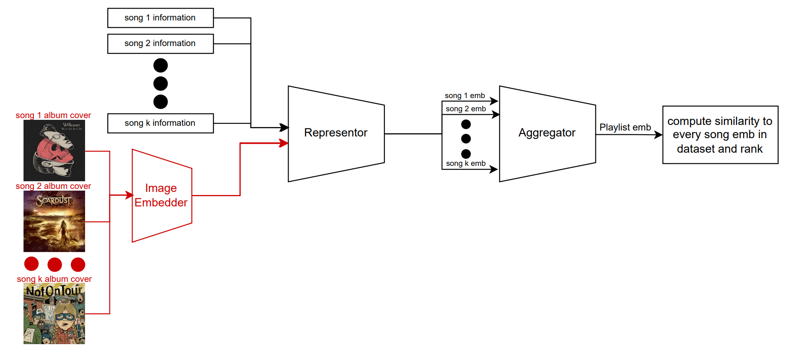
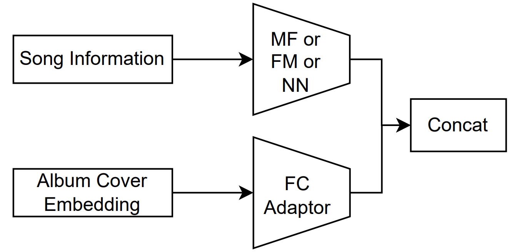

# Enhancing ”A Scalable Framework for Automatic Playlist Continuation on Music Streaming Services” with Album Covers

This repository is a fork of **A Scalable Framework for Automatic
Playlist Continuation on Music Streaming Services** by Deezer. The original repository can be found [here](https://github.com/deezer/APC-RTA).

## Introduce Album Covers

To introduce album covers into "A Scalable Framework for Automatic Playlist Continuation on Music Streaming Services",
we add embeddings of the album covers from CLIP or DINOv2 to the RTA framework.
We also change the representor models to adapt to this input change.

The overview of our method is as follows:
<p align="center">
  
</p>

The modification to the represntor is as follows:
<p align="center">
  
</p>

## Installation

### Code

```
git clone https://github.com/TomerMe2/APC-RTA-With-Album-Covers
cd APC-RTA-With-Album-Covers
pip install -r requirements.txt
clearml-init
```

### Data

1. Download Spotify's Million Playlist Dataset (MPD) on [AIcrowd.com](https://www.aicrowd.com/challenges/spotify-million-playlist-dataset-challenge). You would need to create an account and register to the challenge to do so.
<p align="center">
  
</p>

2. Unzip all files in a single folder, for instance: `resources/data/raw_MPD`.
3. Run the following script to pre-process and format the MPD (expected time: around 1 hour on a regular laptop).
The first script doesn't require a GPU. The second script requires a GPU with at least 6GB of memory.
```
export PYTHONPATH=.
python src/format_rta_input.python --mpd_path PATH/TO/UNZIPPED/MPD
python src/create_initial_embeddings --out_path resources/data
```
4. Go into Spotify's Developer Dashboard and create a new app to get a client ID and a client secret.
4. run:
```
python src/get_album_covers.py --spotify_client_id YOUR_SPOTIFY_CLIENT_ID --spotify_client_secter YOUR_SPOTIFY_CLIENT_SECRET --data_path PATH/TO/UNZIPPED/MPD --output_path ALBUM/COVERS/OUTPUT/PATH --start_from_file 0
```
It can get stuck during the run due to the Spotify API rate limit. In this case, you can change the `start_from_file` parameter to the last file that its album covers were downloaded and run the script again. You may want to consider using a different client ID and client secret to avoid the rate limit.
5. run:
```
python src/create_album_covers_embeddings.py --images_dir ALBUM/COVERS/OUTPUT/PATH --out_path ALBUM/COVERS/EMBEDDINGS/OUT/PATH --batch_size 256
```
If your run dies with GPU memory error, you can reduce the `batch_size` parameter.
6. run:
```
python src/merge_album_covers_embeddings.py --embeddings_dir ALBUM/COVERS/EMBEDDINGS/OUT/PATH/clip
python src/merge_album_covers_embeddings.py --embeddings_dir ALBUM/COVERS/EMBEDDINGS/OUT/PATH/dinov2
```

## Run Experiments

### Train RTA-With-Album-Covers models

Training the models requires a GPU with at least 24GB of memory.
Train the **MF-Transformer** model from the paper:
```
python src/train_with_album_covers --model_name FM-Transformer --recos_path resources/recos --models_path resources/models --data_manager_path resources --albums_covers_embs_algorithm clip --adapter_emb_size 64 --run_name fm_clip_emb_size_64 
```
Notes:

* To train another model, replace `FM-Transformer` in the above command with `MF-Transformer` or `NN-Transformer`.
* To use another album covers embeddings algorithm, replace `clip` in the above command with `dinov2`.
* The complete list of parameters for each model is available in `resources/params/best_params_rta.json`.
* The `run_name` parameter is used to save the run logs in ClearML.

### Evaluate RTA-With-Album-Covers models

To compute all the metrics as shown in our report, run:

```
python src/compute_all_metrics --recos_paths resources/recos/FM-Transformer_dinov2_64_FM-Transformer.npy --data_manager_path resources
```

Notes:
* To evaluate another model, replace the `recos_path` with the path of the recos of the model that you want to evaluate.

## Results
| Models                                           | Precision (%) | Recall (%) | R-Precision (%) | NDCG (%) | Clicks | Popularity (%) | Coverage (%) |
|--------------------------------------------------|---------------|------------|------------------|----------|--------|----------------|--------------|
| MF-Transformer as reported in the original paper | 5.20 ± 0.09 | 39.76 ± 0.47 | 22.30 ± 0.28 | 29.04 ± 0.38 | 2.60 ± 0.17 | 10.46 ± 0.13 | 5.35 |
| MF-Transformer reproduced                        | **5.21 ± 0.09** | **39.78 ± 0.47** | **22.34 ± 0.28** | **29.09 ± 0.38** | 2.57 ± 0.17 | 10.63 ± 0.13 | 5.20 |
| CLIP-MF-Transformer                              | 5.07 ± 0.09 | 38.96 ± 0.47 | 21.79 ± 0.27 | 28.33 ± 0.37 | **2.48 ± 0.16** | **9.63 ± 0.12** | **6.49** |
| DINOv2-MF-Transformer                            | 5.1 ± 0.09 | 39.15 ± 0.47 | 22.01 ± 0.27 | 28.62 ± 0.37 | 2.59 ± 0.17 | 9.72 ± 0.12 | 5.61 |
|                                                  ||||||||
| FM-Transformer as reported in the original paper | 5.31 ± 0.09 | 40.46 ± 0.47 | 22.29 ± 0.27 | 29.21 ± 0.37 | 2.52 ± 0.17 | **11.74 ± 0.13** | 10.18 |
| FM-Transformer reproduced                        | **5.34 ± 0.09** | **40.7 ± 0.47** | **22.42 ± 0.27** | **29.33 ± 0.37** | 2.42 ± 0.16 | 12.03 ± 0.13 | 10.24 |
| CLIP-FM-Transformer                              | 5.28 ± 0.09 | 40.2 ± 0.47 | 22.06 ± 0.27 | 28.86 ± 0.37 | **2.32 ± 0.15** | 11.77 ± 0.13 | 10.64 |
| DINOv2-FM-Transformer                            | 5.27 ± 0.09 | 40.15 ± 0.47 | 22.03 ± 0.27 | 28.85 ± 0.36 | 2.48 ± 0.16 | 11.89 ± 0.13 | **10.98** |
|                                                  ||||||||
| NN-Transformer as reported in the original paper | **5.26 ± 0.09** | **40.17 ± 0.47** | 21.18 ± 0.27 | **29.14 ± 0.37** | **2.17 ± 0.15** | 10.33 ± 0.13 | 11.81 |
| NN-Transformer reproduced                        | 5.11 ± 0.09 | 39.13 ± 0.47 | 21.54 ± 0.27 | 28.3 ± 0.37 | 2.34 ± 0.15 | 9.34 ± 0.13 | **16.29** |
| CLIP-NN-Transformer                              | 5.09 ± 0.09 | 39.01 ± 0.47 | 21.52 ± 0.27 | 28.27 ± 0.37 | 2.39 ± 0.15 | **9.26 ± 0.12** | 15.85 |
| DINOv2-NN-Transformer                            | 5.13 ± 0.09 | 39.33 ± 0.47 | **21.74 ± 0.27** | 28.54 ± 0.37 | 2.24 ± 0.15 | 9.64 ± 0.13 | 16.06 |

## Conclusions
We improve the Clicks metric for MF and FM models. <br/>
We improve the populairty and coverage metrics for the MF model, and only the coverage metric for the FM model. <br/>
We couldn't reproduce the results of the NN model corretly, even though we used the same code of the original paper. <br/>
Our method negatively impacts accuracy oriented metrics that are not Clicks.
We argue that Clicks is the most important accuracy oriented metric since this is what a user will feel when using the playlist continuation feature in music streaming services. <br/>

More information can be found in our [report](APC_RTA_with_album_covers_report.pdf).